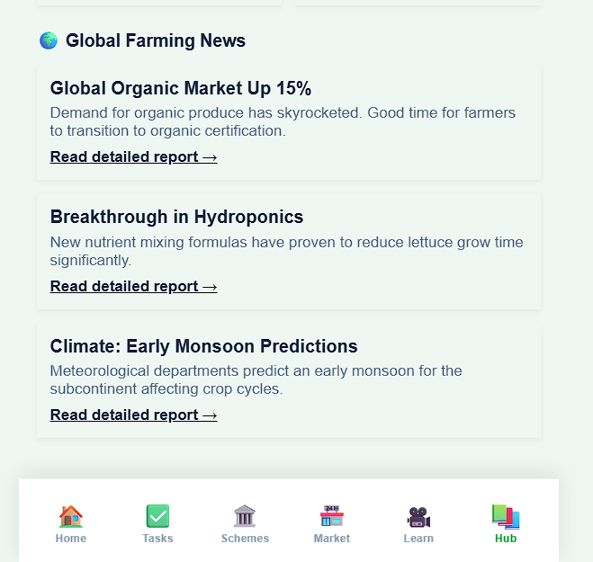
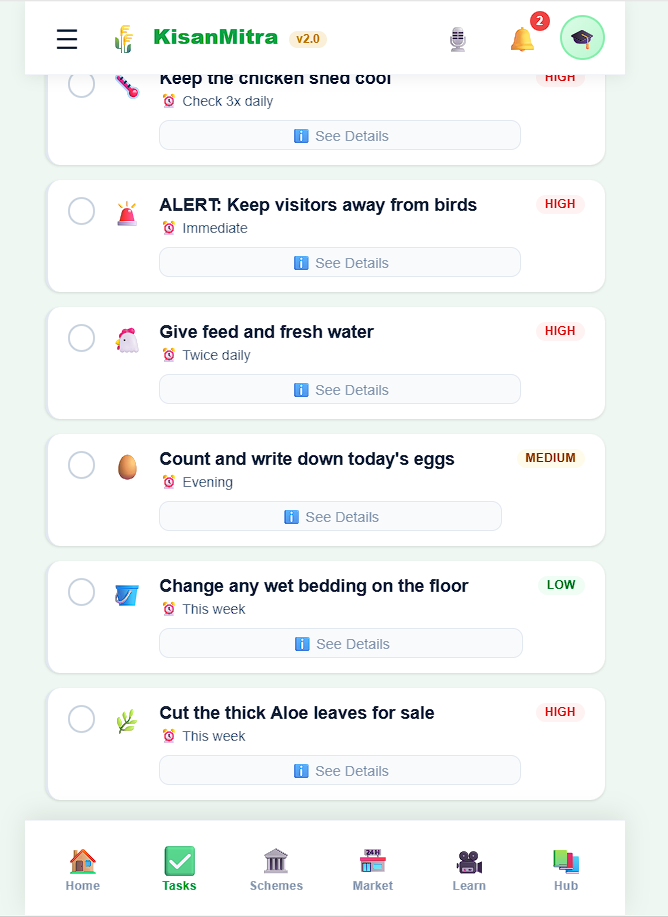
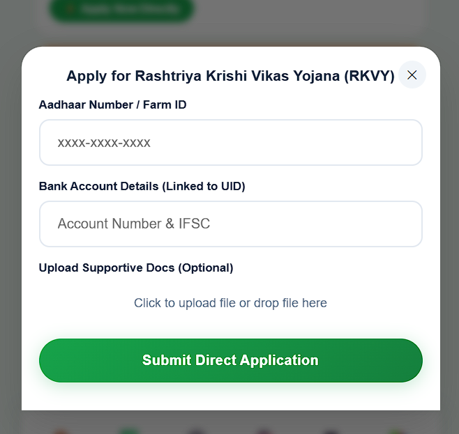
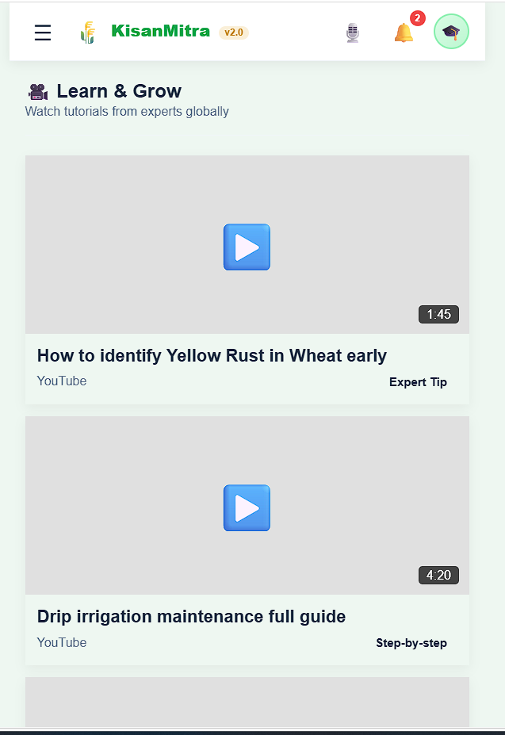
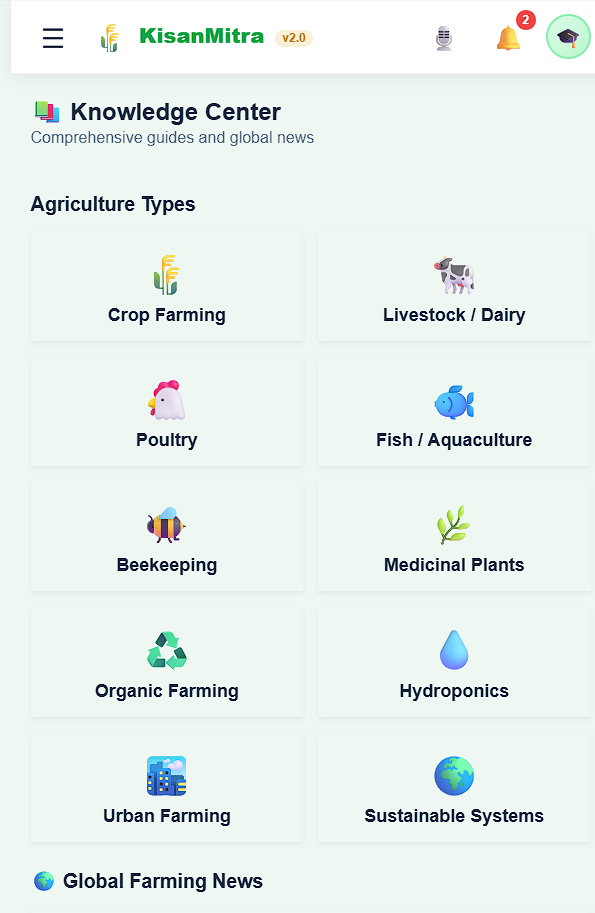
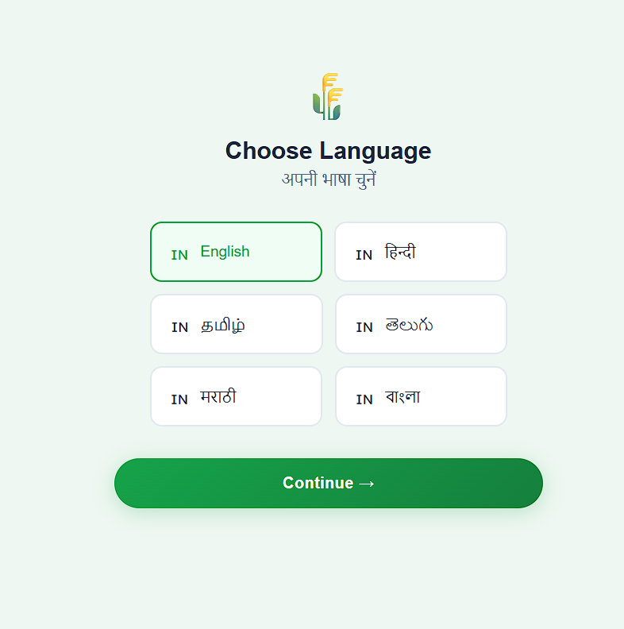
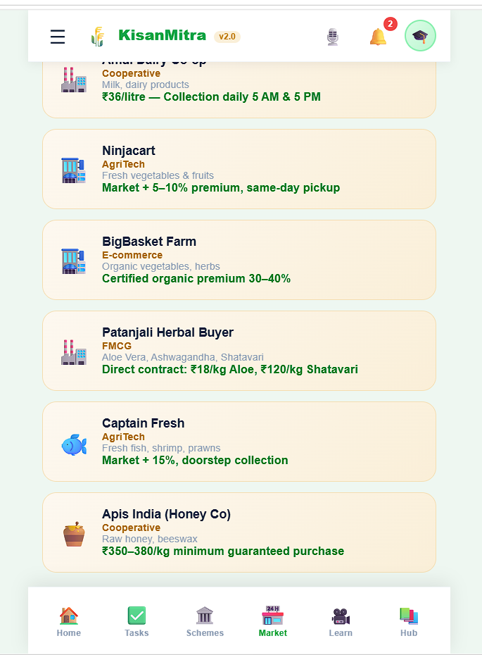
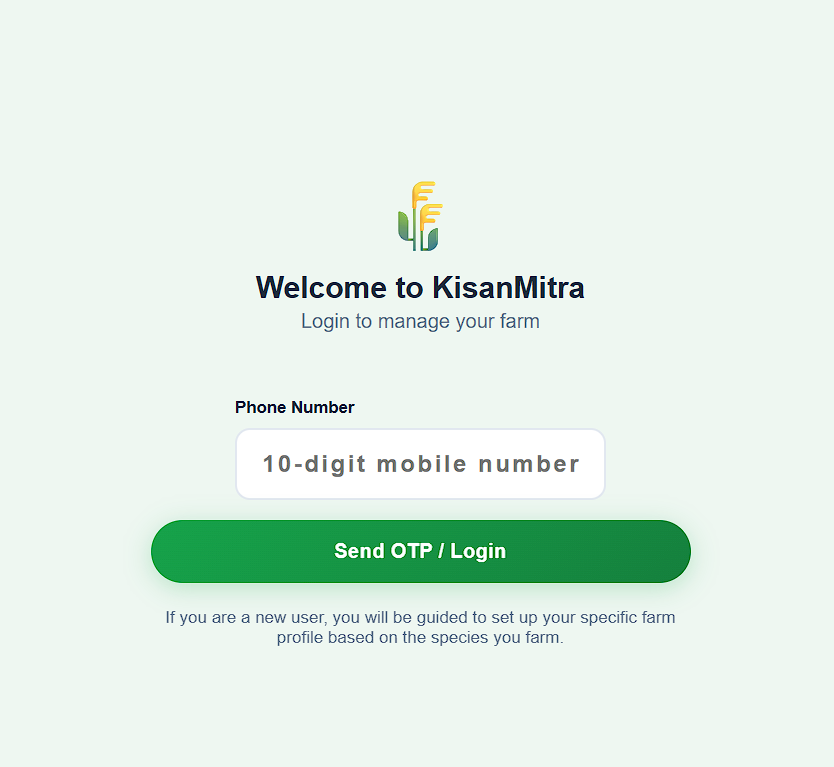

# 🌾 Smart Agriculture Advisory System

🚀 Built to solve real-world agricultural challenges using AI, real-time data, and user-centric design.

> A unified platform that helps farmers decide, learn, and earn using real-time data and intelligent recommendations.

---

## 🚀 Features

### 🌱 Personalized Advisory

* Dynamic daily tasks based on:

  * Crop type / livestock
  * Farming method (organic, hydroponics, etc.)
  * Experience level

### 🌍 Real-Time Weather + GPS

* Location-based insights
* Live temperature, humidity, rainfall alerts

### 🏛️ Government Schemes

* Discover and apply for schemes like PM-KISAN, PMFBY, eNAM directly within the platform
* Eligibility check
* Direct application support

### 🎥 Learn from Experts

* Educational content from YouTube, Instagram, Snapchat
* Filtered by farming type and experience

### 📚 Knowledge Center

* Farming guides & methods
* Global agriculture news
* Best practices

### 📊 Smart Alerts

* Weather warnings
* Pest/disease risks
* Market insights

---

## 🧠 Problem It Solves

Addresses key agricultural gaps:

* Information Gap
* Prediction Gap
* Access Gap
* Execution Gap

---

## 🛠️ Tech Stack

* Frontend: HTML, CSS, JavaScript
* Backend: Prototype (no backend implemented)
* APIs:

  * Weather API (OpenWeatherMap)
  * GPS Location Services

---

## 🎯 How It Works

1. User enters:

   * Farming type
   * Crops/livestock
   * Experience level

2. System:

   * Uses real-time data (weather + location)
   * Generates personalized recommendations

3. Output:

   * Daily tasks
   * Alerts
   * Learning resources

---

## 📸 Screenshots

### 🏠 Dashboard / Home

### 📋 Tasks & Actions

### 🏛️ Government Schemes

### 🎥 Learn from Experts

### 📚 Knowledge Center

### 🌐 Language / Accessibility

### 📈 Market Insights

### 🔐 Login Page

---

## 📱 Future Scope

* IoT sensor integration
* AI-based crop disease detection
* Voice assistant (regional languages)
* Direct farmer-to-buyer marketplace

---

## 👨‍💻 Author

**Snigdha**
🔗 https://github.com/Snigdha-0210

---
**##Markdown**
🏆 Built for Hackathon – Real-world agriculture impact solution
## ⭐ Support

If you like this project, consider giving it a ⭐ on GitHub!
